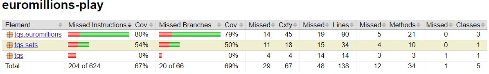
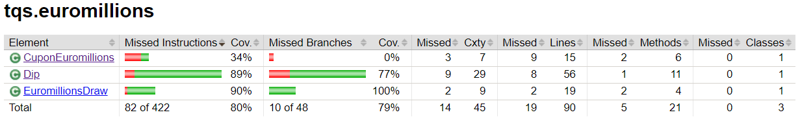
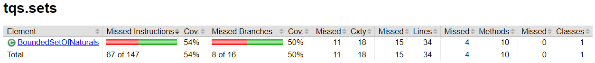
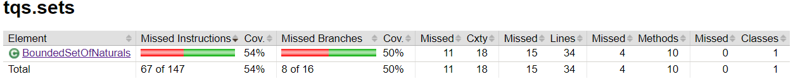
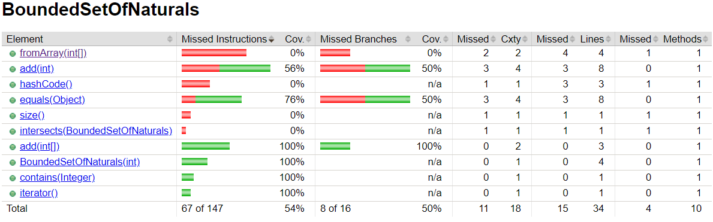
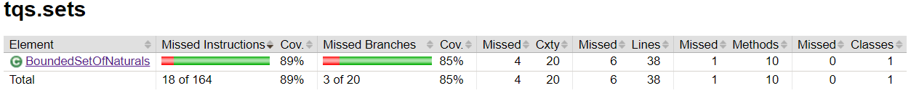
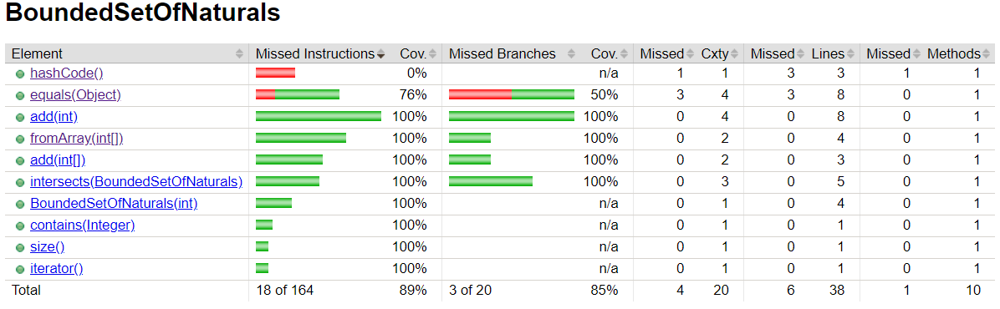

# Notes

## JUnit 5

In this first lab, we will use JUnit 5 to write unit tests for Java Projects, and we will use Maven as a build tool.

### Key Points

- Unit testing is when you (as a programmer) write test code to verify units of (production) code. A unit is a small-scoped, coherent subset of a much larger solution. A true “unit” should not depend on the behavior of other (collaborating) modules.

- Unit tests help the developers to (i) understand the module contract (what to construct); (ii) document the intended use of a component; (iii) prevent regression errors; (iv) increase confidence in the code.

- JUnit and TestNG are popular frameworks for unit testing in Java.

### How to use JUnit 5

#### 1. Add the JUnit 5 dependency to the `pom.xml` file

```xml
<!-- JUnit 5 dependency for tests-->
<dependency>
    <groupId>org.junit.jupiter</groupId>
    <artifactId>junit-jupiter</artifactId>
    <version>5.10.2</version>
    <scope>test</scope>
</dependency>
```

#### 2. Add the Maven Surefire and Failsafe plugins to the `pom.xml` file

```xml
<build>
    <plugins>
        <plugin>
            <artifactId>maven-surefire-plugin</artifactId>
            <version>3.1.2</version>
        </plugin>
        <plugin>
            <artifactId>maven-failsafe-plugin</artifactId>
            <version>3.1.2</version>
        </plugin>
    </plugins>
</build>
```

### How to write JUnit 5 tests

To write a JUnit 5 unit test, we need to follow these steps:

1. Since we are using Maven, we use the `src/test/java` directory to store our test classes;

2. We use the `@Test` annotation to mark a method as a test method;

3. We can use the `@BeforeEach` and `@AfterEach` annotations to mark methods that should be run before and after each test method;

4. We can use the `@BeforeAll` and `@AfterAll` annotations to mark methods that should be run before and after all test methods;

5. We can use the `@DisplayName` annotation to provide a custom display name for the test class or test method;

6. We can use the `@Disabled` annotation to disable a test class or test method;

7. In order to assert the expected result of a test, we use the `Assertions` class that can be imported from `org.junit.jupiter.api.Assertions`. This has method to check for equality, nullity, exceptions, if a condition is true/false, etc.

## JaCoCo

**JaCoCo** is a free code coverage library for Java. It is used to measure how many lines, branches, and cyclomatic complexity of the code are executed during automated tests.

### How to use JaCoCo with Maven

1. Add the JaCoCo plugin to the `pom.xml` file

```xml
<plugin>
    <groupId>org.jacoco</groupId>
    <artifactId>jacoco-maven-plugin</artifactId>
    <version>0.8.8</version>
    <executions>
        <execution>
            <goals>
                <goal>prepare-agent</goal>
            </goals>
        </execution>
        <execution>
            <id>report</id>
            <phase>prepare-package</phase>
            <goals>
                <goal>report</goal>
            </goals>
        </execution>
    </executions>
</plugin>
```

Running the test using JUnit will automatically set in motion the JaCoCo agent. It will create a coverage report in binary format in the target directory, target/jacoco.exec.
Obviously we can’t interpret the output single-handedly, but other tools and plugins can, e.g. Sonar Qube.
The good news is that we can use the jacoco:report goal in order to generate readable code coverage reports in several formats, like HTML, CSV, and XML.

2. Create a report

```bash
$ mvn clean test jacoco:report
```

You should get an HTML report under target/site/jacoco/index.html.

### Analyzing the report

Overall coverage:



Class coverage:





#### Which classes/methods offer less coverage? Are all possible [decision] branches being covered?

First, the `CuponEuromillions` class has a low coverage in the **countDips()** and **format()** methods. These have no unit tests.

Second, the `Dip` class has a low coverage in the **hashCode()** and
**equals()** methods. In the **equals()** method, there are no tests to cover all the if statements, only when it does not enter any of them. The **hashCode()** method, does not have any unit tests.

Third, the `EuromillionsDraw` class has a low coverage in the **generateRandomDraw()** and **getDrawResults()** methods. These two have no unit tests.

Finnaly, the `BoundedSetOfNaturals` class has a coverage of 54% and only 50% of the decision branches (if statments) are being covered. The methods
**fromArray()**, **hashCode()**, **size()** and **intersects()** have no unit tests, the **add()** method has 56% of coverage and only 50% of the decision branches are being covered, and the **equals()** method has 76% of coverage and only 50% of the decision branches are being covered.

#### What kind of unit test are worth writing for proper validation of BoundedSetOfNaturals?

1. **testAddElement()** - In this test we check if the element is added to the set and if the size of the set is incremented by 1. Also tested what happens when we try to add an element that already exists in the set, add a non-natural number and add more elements than the maximum size of the set (should throw an exception).

2. **testAddFromBadArray()** - This test is similar to the previous one, but instead of adding elements one by one, we add an array of elements. We test the same cases as the previous test.

3. **testIntersection()** - In this test we check if the intersection of two sets is correct. We test the intersection of two sets that have no elements in common, two sets that have all elements in common, two sets that have some elements in common and two sets that are the same.

#### Before the changes





#### After the changes



