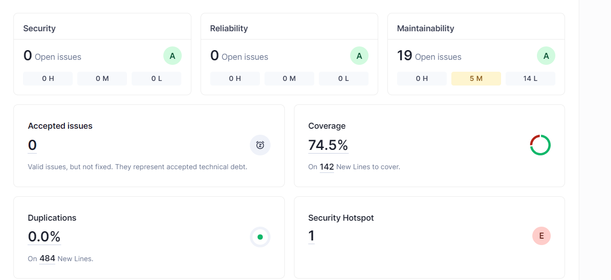
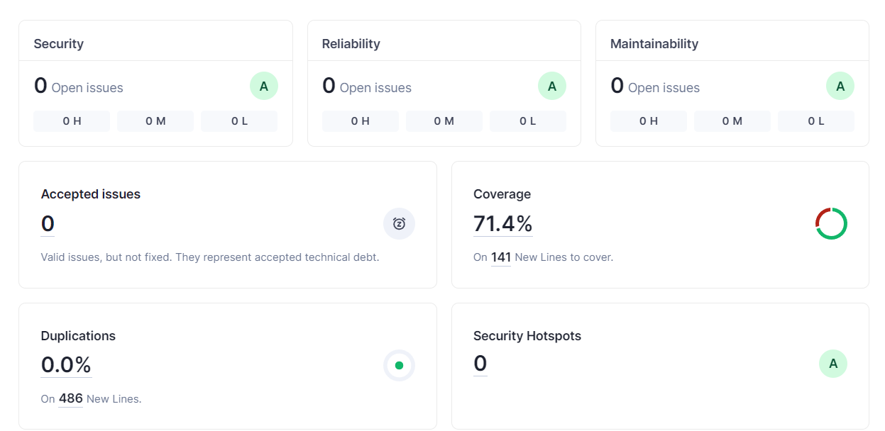

# Lab6_1

## e)

The project passed the defined Quality Gate, eventough it only has 74.5% of coverage, 19 Maintainability Issues and 1 Security Hotspot. It is not perfect has we can see but the parts that are not covered do not need to be. The issues and the security hotspot will be fixed.

## f)

| Issue | Problem Description | How to Solve |
| ----- | ------------------- | ------------ |
| Security Hotspot | **Random()** `from java.util.Random` only generates pseudo-random numbers, and should not be used for security reasons | Use **SecureRandom()** from `java.security.SecureRandom` instead |
Code Smell (Major) | Invoke method(s) only conditionally | Use `log.isInfoEnabled()` before making an info log that calls methods inside it |
| Code Smell (Major) | Refactor the code in order to not assign to this loop counter from within the loop body | The counter was being incremented in the end of the for, to prevent this issue, make this increment outside the loop's body (where the variable is assigned) |
| Code Smell (Minor) |  Remove this unused import 'java.security.NoSuchAlgorithmException' | Remove the import that is not being used |
| Code Smell (Minor) | Reorder the modifiers to comply with the Java Language Specification | Java Language Specification recommends listing modifiers in a specific order, in this case `static public` needs to be `public static` |
| Code Smell (Minor) | The return type of this method should be an interface such as "List" rather than the implementation "ArrayList" | Just change the return type of the method from "ArrayList" to "List" |
| Code Smell (Minor) | Replace the type specification in this constructor call with the diamond operator ("<>") | Change the type defined inside the "<>" with nothing, in this case: `ArrayList<Dip> results = new ArrayList<Dip>()` becomes `ArrayList<Dip> results = new ArrayList<>()` |
| Code Smell (Info) | Remove this 'public' modifier | Just remove the 'public' modifier as requested |

