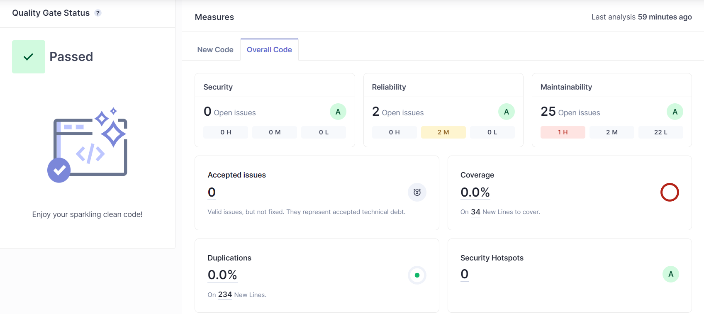
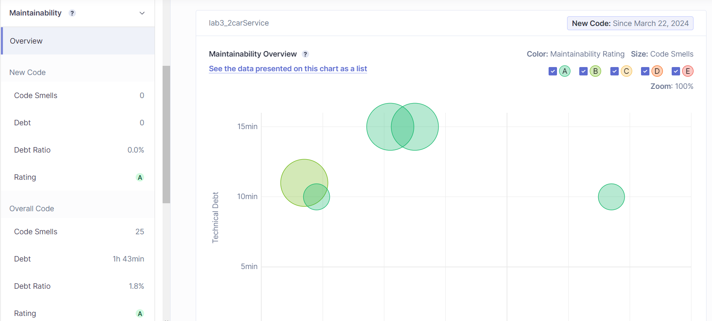
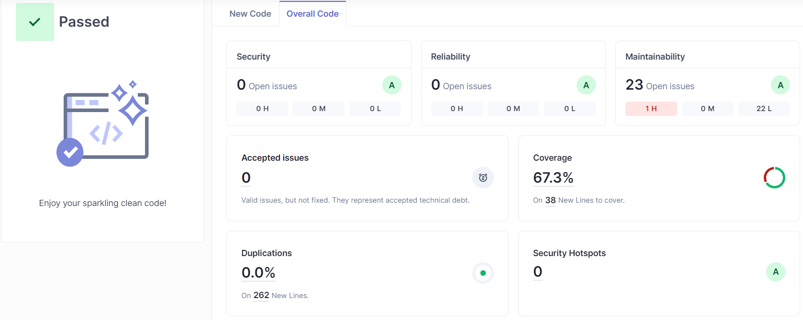

# lab6_2

## a)

The Technical Debt Found in the Code is **1h 43m**. This refers to the time that is needed to fix the issues found in the code, it is the concept of accumulating additional work in the future as a result of choosing an easy or quick solution instead of a better, more sustainable approach during software development.





## b)

| Issue | Problem Description | How to Solve |
| ----- | ------------------- | ------------ |
| Code Smell (Major) | Remove this field injection and use constructor injection instead | Remove the **@Autowired** annotation from the field and add it to the constructor instead |

This was the only severe code smells (critical and major) reported.

## c)

Added the JaCoCo plugin to the project:

```xml
<plugin>
    <groupId>org.jacoco</groupId>
    <artifactId>jacoco-maven-plugin</artifactId>
    <version>0.8.7</version>
    <executions>
        <execution>
            <goals>
                <goal>prepare-agent</goal>
            </goals>
        </execution>
        <execution>
            <id>report</id>
            <phase>prepare-package</phase>
            <goals>
                <goal>report</goal>
            </goals>
        </execution>
    </executions>
</plugin>
```

After running the report, I obtained a **67.3%** of code coverage.



Having this low code coverage might seem like a problem, but after analyzing the report, I found that the uncovered lines are mostly lines that cannot or do not have an interest in being tested. For example, the **main** method in the **Lab32carServiceApplication** class and the **toString**, **equals** and **hashCode** methods in the **Car** class. The test that may be missing is one for the method **saveCar(Car car)** in the **CarManagerService** class.