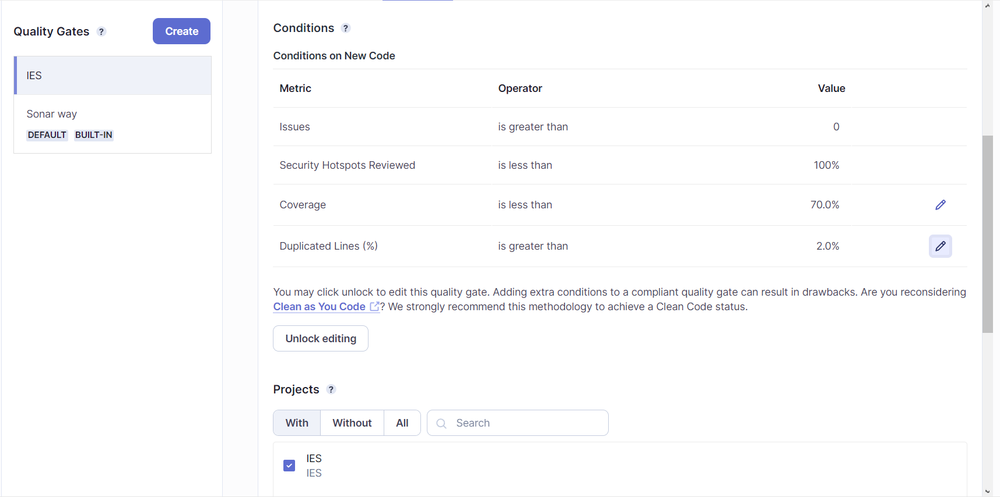
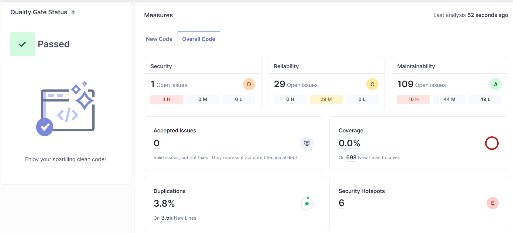
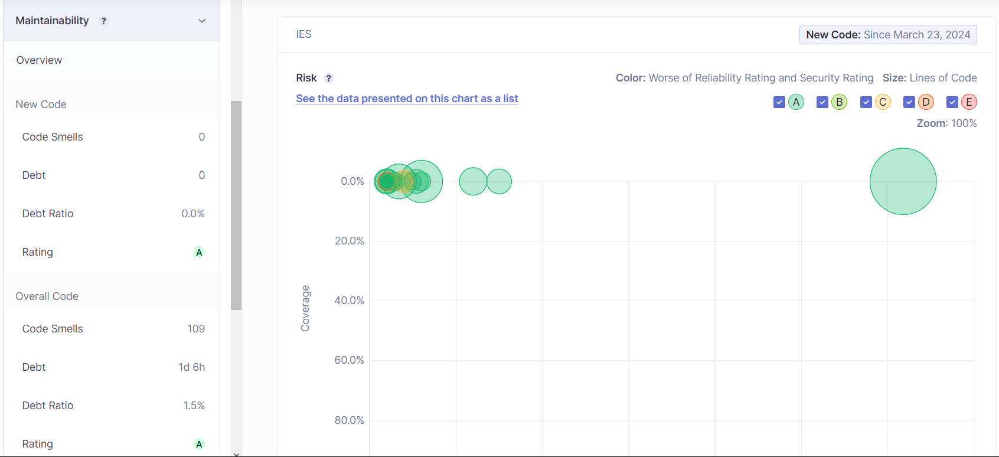

# lab6_3

## a)

As seen in the image above, I have created a quality gate that checks if the code coverage is less than 70% and if the code duplication is greater than 2%. I have done this because as seen before, the code coverage is important but sometimes we cannot test every single line of code, and the code duplication is important because it can lead to bugs and it is not efficient (bad habit) to have duplicated code.

## b)

Code coverage is **0%** as expected, since there were no tests implemented. A high number of Code Smells were found, which was not to be expected and seeing in the second image, the technical debt is high, **1d 6h**. This is because the code is not clean and there are many code smells, which can lead to bugs and make the code harder to maintain.